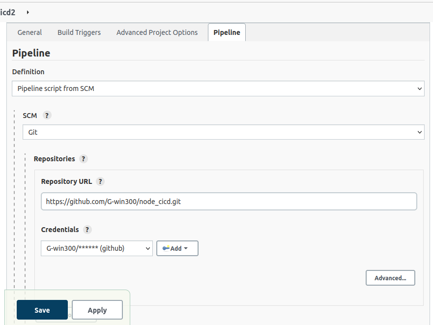
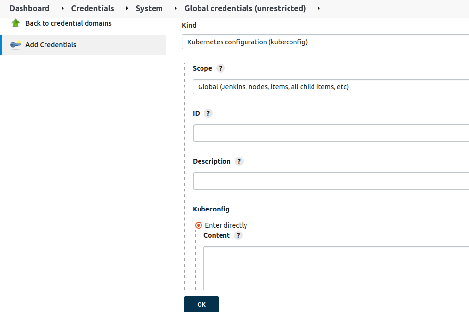

## **CICD PIPELINE PROJECT TO DEPLOY TO KUBERNETES CLUSTER USING JENKINS**  
### jenkins integration using kubernetes

---
STEP 1: Get your environment ready
since we are using jenkins as our Continous integration agent, we need to install the necessary plugins it will require.

go to MANAGE JENKINS and install docker pipeline plugin
since we will also be deploying to kubernetes later on, we also need to install kubernetes plugin.
note: the latest kubernetes plugin you'll see is faulty, so we will need to install an earlier stable version. you can download it via this link

STEP: pull our simple application that we need to run from this repo  
create a file called **Dockerfile** and paste this code  
```
FROM node:latest
ENV NODE_ENV=production

WORKDIR /app

COPY ["package.json", "package-lock.json*", "./"]

RUN npm install --production

COPY . .

EXPOSE 3000

CMD [ "node", "index.js" ]
```


---
STEP: still in our current directory, created a deployment-service.yaml file.  
this file contains both our kubernetes deployment and service configuration.

```
apiVersion: apps/v1
kind: Deployment
metadata:
  name: nodeapp-deployment
  labels:
    app: nodeapp
spec:
  replicas: 2
  selector:
    matchLabels:
      app: nodeapp
  template:
    metadata:
      labels:
        app: nodeapp
    spec:
      containers:
      - name: nodeapp
        image: gwin300/node-app
        ports:
        - containerPort: 3000

---
apiVersion: v1
kind: Service
metadata:
  name: nodeapp-service
spec:
  selector:
    app: nodeapp
  type: NodePort
  ports:
    - protocol: TCP
      port: 8887
      targetPort: 3000
      nodePort: 32000
```

**note:** it should be noted that in this file, we used **nodePort** instead of loadBalancer because we are not using the cloud. 

---
STEP: Create our **Jenkinsfile**  
this is the file that jenkins will search for first. this file tells jenkins everything it should do.  
**note** this file should also be in the same directory as all the aformentioned files.

```
pipeline {
  environment {
    dockerImageName = "gwin300/node-app"
    dockerImage = ""
}
    agent any
  stages{
    
        stage('build') {
            steps {
                script {
                    dockerImage = docker.build dockerImageName
                      }
                  }
            }
        
        stage('push docker image') {
            environment {
                registryCredentials = "docker"
                        }
            steps {
                script {
                  docker.withRegistry( 'https://registry.hub.docker.com', registryCredentials ) {
                    dockerImage.push("latest")
                }
            }
        }
     }
        
        stage('kubernetes deploy') {
            steps {
                script {
                    kubernetesDeploy(configs: "deployment-service.yaml", kubeconfigId: "kubernetes")
                }
            }
    }
}
}
```
---
#### our Jenkinsfile has a three pipeline phase  
1. build our image with our application inside
2. push our application to our dockerhub repo
3. using our kubernetes configurations, it will execute every configuration in our deployment-service.yaml file which includes  
   * creating our deployment with 2 replicas
   * creating a internal service running on port 8887 (you any port you like)
   * creating an external nodePort service running on port 32000 (use any port you like)

---
STEP: commit changes to file and push to github

STEP: at our jenkins application, we created a pipeline project

Under pipeline, input configuration like so



STEP: we need to give jenkins our kubernetes configuration details.  
this is to enable jenkins create our deployment.

type command `ls -la && cd .kube`  
`cat config`  
copied all the content of the config file to our jenkins under the **manage credentials** like so



---
