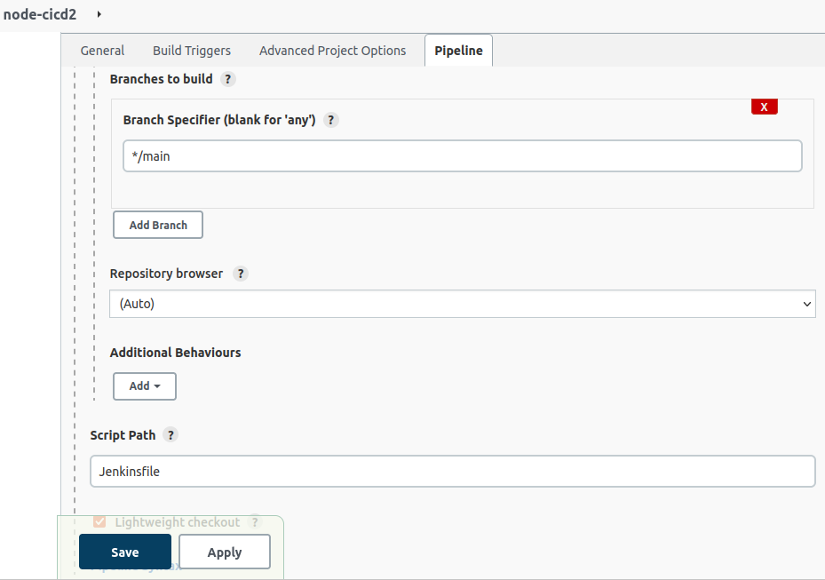

## CI-CD PIPELINE PROJECT

### DEPLOYING APPLICATION TO KUBERNETES CLUSTER USING JENKINS    
### jenkins integration using kubernetes

---
**STEP 1:** Get my environment ready
since i am using jenkins as my Continous integration agent, i needed to install the necessary plugins it will require.

Under *MANAGE JENKINS*, i installed **docker pipeline plugin**
since i will also be deploying to kubernetes later on, i also installed **kubernetes continous deploy** plugin.
note: the latest kubernetes continous deploy plugin you'll see is faulty, so i had to install an earlier stable version.

**STEP 2:** pull our simple application that we need to deploy  
create a file called **Dockerfile** and paste this code  
```
FROM node:latest
ENV NODE_ENV=production

WORKDIR /app

COPY ["package.json", "package-lock.json*", "./"]

RUN npm install --production

COPY . .

EXPOSE 3000

CMD [ "node", "index.js" ]
```


---
**STEP 3:** still in our current directory, i created a deployment-service.yaml file.  
this file contains both our kubernetes deployment and service configuration.

```
apiVersion: apps/v1
kind: Deployment
metadata:
  name: nodeapp-deployment
  labels:
    app: nodeapp
spec:
  replicas: 2
  selector:
    matchLabels:
      app: nodeapp
  template:
    metadata:
      labels:
        app: nodeapp
    spec:
      containers:
      - name: nodeapp
        image: gwin300/node-app
        ports:
        - containerPort: 3000

---
apiVersion: v1
kind: Service
metadata:
  name: nodeapp-service
spec:
  selector:
    app: nodeapp
  type: NodePort
  ports:
    - protocol: TCP
      port: 8887
      targetPort: 3000
      nodePort: 32000
```

**note:** it should be noted that in this file, we used **nodePort** instead of loadBalancer because we are not using the cloud. 

---
**STEP 4:** Created my **Jenkinsfile**  
this is the file that jenkins will search for first. this file tells jenkins everything it should do.  
**note** this file is located in the root directory of our project application... samething with all the aformentioned files.

```
pipeline {
  environment {
    dockerImageName = "gwin300/node-app"
    dockerImage = ""
}
    agent any
  stages{
    
        stage('build') {
            steps {
                script {
                    dockerImage = docker.build dockerImageName
                      }
                  }
            }
        
        stage('push docker image') {
            environment {
                registryCredentials = "docker"
                        }
            steps {
                script {
                  docker.withRegistry( 'https://registry.hub.docker.com', registryCredentials ) {
                    dockerImage.push("latest")
                }
            }
        }
     }
        
        stage('kubernetes deploy') {
            steps {
                script {
                    kubernetesDeploy(configs: "deployment-service.yaml", kubeconfigId: "kubernetes")
                }
            }
    }
}
}
```
---
#### Jenkinsfile has a three pipeline phase  
1. build an image with my application inside
2. push the image to my dockerhub repo
3. using my kubernetes configurations, it will execute every configuration in my deployment-service.yaml file which includes  
   * creating a deployment with 2 replicas
   * creating a internal service running on port 8887 
   * creating an external nodePort service running on port 32000

---
**STEP 5:** commit changes to file and push to github

**STEP 6:** at my jenkins application, i created a pipeline project

Under pipeline, configurations was inputted like so




**STEP 7:** i need to give jenkins our kubernetes configuration details.  
this is to enable jenkins create our deployment.

type command `ls -la && cd .kube`  
`cat config`  
copied all the content of the config file to our jenkins under *manage credentials*  **kubeconfig** and pasted it inside **content** like so


---

**STEP 8:** ran my pipeline.
